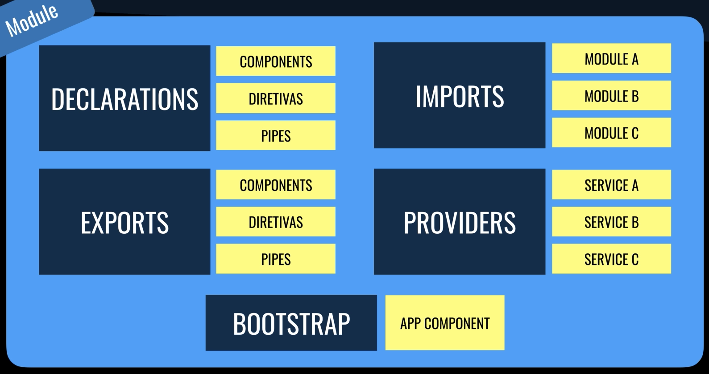

# O projeto
Feito em Angular 9 para aprendizado e retirado do curso do Leonardo Leitão e [disponível gratuitamente no YouTube](https://www.youtube.com/playlist?list=PLdPPE0hUkt0rPyAkdhHIIquKbwrGUkvw3).
É um CRUD de produtos.

# Backend simples feito em JSON Server
O foco aqui é desenvolver a parte de Angular por isso não tivemos foco na parte do backend.
A api foi feita utilizando [JSON server](https://www.npmjs.com/package/json-server) uma forma fácil de criar um bd utilizando JSON. Para ver como foi feito acesse a pasta backend.

# FrontEnd

# Árvore de Componentes


# Inicialização da APP


## Diferença no Angular - Modulo
- Diferente de outros framework JS o angular possui mas uma camada que é
os Modulos os quais podem armazenar dentro deles os componentes. 
E esses componentes dentro dos modulos só podem ser vistos no seu modulo.

# O que é um Componente?


## Estrutura de um Componente Angular
- Componente Angular deve ser formado por três elementos,
template (HTML), estilo (CSS) e classe (TypeScript). 
Essas partes são organizadas em arquivos separados e unidas nos metadados 
do componente através do decorator @Component.

# Organização Usando Módulo

- Na imagem apenas o componente H poderia ficar dentro do módulo Y
porque ele é único referenciado dentro do módulo. 
Os outros todos são referenciados por componentes fora do módulo.

## O que são módulos
- No contexto do Angular um módulo é a forma de agrupar 
componentes, diretivas, pipes e serviços que são relacionados.

## Anatomia do Módulo


## Crindo o projeto

Primeiro instalamos a [CLI do Angular](https://cli.angular.io/). 

```
npm i -g @angular/cli
```

### ng new nome_diretorio

A CLI Angula facilita a criação de um aplicativo que já funciona, pronto para uso.

```
ng new frontend
```

Va para a pasta frontend

```
cd frontend
```

e start o projeto 

```
npm start
```

ele vai abrir no link: http://localhost:4200/

# Attribute Directives (Diretivas de Atributos)

Altera a aparência e o comportamento de um elemento,
componente ou outra diretiva.

```ts
@Directive({
    selector: '[appRed]'
})
export class RedDirective {
    constructor(el: ElementRef) {
        el.nativeElement.style.color = '#e35e6b';
    }
}
```

```html
<i class="material-icons v-middle" appRed>
    favorite
</i>
```

## Criando diretiva no CLI do Angular

```
ng g d directives/red
```

# Structural Directives (Diretivas estruturais)

Altera o layout adicionando e removendo elementos da [DOM](https://tableless.com.br/entendendo-o-dom-document-object-model/).


```html
<form *ngIf="product" class="product-form"></form>
```

```html
<ul>
    <li *ngFor="let product of products">
        {{ product.name }}
    </li>
</ul>
```

# Property Binding (Vinculação de Propriedade)

```html
<table [dataSource]="products"></table>
```

```ts
@Component({
    selector: 'app-product-read',
    templateUrl: './product-read.component.html',
    stylesUrls: ['./product-read.component.css']
})
export class ProductReadComponent {
    implements OnInit {
        products: Product[];
    }
}
```

# Event Binding (Vinculação de Evento)

```html
<button
    mat-raised-button
    (click)="createProduct()"
    color="primary">
    Salvar
</button>
```

```ts
@Component({
    selector: 'app-product-create',
    templateUrl: './product-Create.component.html',
    stylesUrls: ['./product-Create.component.css']
})
export class ProductCreateComponent implements OnInit {
        createProduct(): void {
            // ...
        }
    }
```

# One Way Data Binding

Modificou no TS muda no html em apenas uma direção. 

```html
<input [value]="nome">
```

```ts
nome: string;
```

# Two Way Data Binding

Se você alterar no TS ele vai mudar no HTML e se você mudar no 
HTML ele vai alterar no TS.

```html
<input [(ngModel)]="nome">
```

```ts
nome: string;
```

# Angular Router

```html
<a routeLink="/products">
    Produtos
</a>    
```

```html
<mat-sidebar-content>
    <router-outlet></router-outlet>
</mat-sidebar-content>
```

```ts
const routes: Routes = [{
    path: "products",
    component: ProductCrudComponent
}, {
    path: "products/create",
    component: ProductCreateComponent
}];
```

# Angular Pipes

Processamentos em variáveis.

No exemplo estamos formatando a variável para ficar no formado de date.

Esse é o símbolo chmado pipe: |

```html
<p>
    O vencimento é
    {{ produto.vencimento | date }}
</p>
```

```html
<td mat-cell *matCellDef="let product">
    {{ produto.price | currency: 'BRL' }}
</td>
```

Cadeia de pipes:

```html
<p>
    O vencimento é
    {{ produto.vencimento | date: 'fullDate' | uppercase }}
</p>
```

# Programação Reativa

Angular usa o framework ReactiveX.

```ts
import { Observable } from "rxjs";
```

# O Padrão Observer

- Padrão orientado a `Evento`!
- Função sendo passada como parâmetro para outra função: [callbacks](https://medium.com/totvsdevelopers/entendendo-fun%C3%A7%C3%B5es-callback-em-javascript-7b500dc7fa22).
- [Assíncrono: callbacks, promises e async functions.](https://medium.com/@alcidesqueiroz/javascript-ass%C3%ADncrono-callbacks-promises-e-async-functions-9191b8272298)
- callbacks -> promises -> Observables.

O Observer é um padrão de projeto de software que define uma dependência um-para-muitos entre objetos de modo que quando um objeto muda o estado, todos seus dependentes são notificados e atualizados automaticamente. Permite que objetos interessados sejam avisados da mudança de estado ou outros eventos ocorrendo num outro objeto.

O padrão Observer é também chamado de Publisher-Subscriber, Event Generator e Dependents.

FONTE: [wikipedia](https://pt.wikipedia.org/wiki/Observer)

### Pseudo código:

```ts
criarNoBackend(produto: Produto): Observable<Produto> {
    return this.http.post<Produto>(this.url, produto);
}
```

```ts
criarProduto(): void {
    this.criarNoBackend(this.produto).subscribe(() => {
        this.exibirMensagem("Salvo com sucesso!");
    })
}
```

# Services e Injeção de Dependência [Angular Docs](https://angular.io/guide/architecture-services)

São classes que têm como principal objetivo <span style="color:green">organizar</span> e <span style="color:red">compartilhar</span> <ins>métodos</ins> e <ins>dados</ins> entre `componentes`.

Posso usar services dentro de diretivas por exemplo.

Pode também compartilhar dados entre os componentes. 

## Criando um service

Comando CLI
```
ng g s services/product
```

Classe de exemplo
```ts
@Injectable({
    providedIn: "root",
})
export class ProductService {
    // ...
}
```

```ts
providedIn: "root" é o que chamamos de AppModule o Injector.
```

Services são [singletons](https://pt.wikipedia.org/wiki/Singleton) dentro do escopo de um `injector`.

- Injector:
    - ModuleInjector:
        ```ts 
        @NgModule 
        ```
        ```ts 
        @Injectable 
        ``` 
    - ElementInjector:
        ```ts 
        @Directive
        ```
        ```ts 
        @Component
        ``` 

Mais informações na [Documentação do Angular](https://angular.io/guide/hierarchical-dependency-injection)

## Injeção de Dependência

É um padrão no qual a classe recebe as <span style="color:red">dependências</span> de uma <span style="color:green">fonte externa</span> ao invés de criar por conta própria.

## Exemplo SEM injeção de dependência

Sempre que eu modificar a classe motor eu vou precisar modificar a classe Carro
Como no exemplo acrescentando cilindrada a classe motor eu preciso 
agora passar como parâmetro na classe carro. 
Ou seja como Carro cria Motor ele fica muito dependente e isso não é bom.

- Classe Carro

```ts
class Carro {
    motor: Motor

    constructor() {
        this.motor = new Motor()
    }
}
```

- Classe Motor

```ts
class Motor {
    cilindrada: number

    constructor(cilindrada: number) {
        this.cilindrada = new cilindrada
    }
}
```


## Exemplo COM injeção de dependência

- Classe Carro

```ts
class Carro {
    motor: Motor

    constructor(motor: Motor) {
        this.motor = motor
    }
}
```

- Classe Motor

```ts
class Motor {
    cilindrada: number

    constructor(cilindrada: number) {
        this.cilindrada = new cilindrada
    }
}
```

